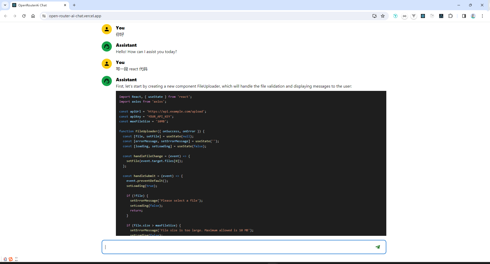

# OpenRouterAi

体验网址：https://4b2df125.open-router-ai-chat.pages.dev/

基于 https://openrouter.ai/ 里面提供的免费model “Mistral 7B Instruct”作为ai provider 为基础开发聊天对话机器人

### 架构

- esLink 代码检测和提示
- pretter 代码风格以及格式化
- husky git 钩子，commit 前用 pretter 格式化代码后用 esLink 检测代码情况
- vercel 云平台部署，关联 github，根据分支 master 更新自动部署

### 技术栈

- create-react-app
- mui
- react-markdown
- openRouterAi
- tailwindCss
- typescript

### 版本

- node v20.11.1
- npm 10.2.4

### 运行

npm run start
